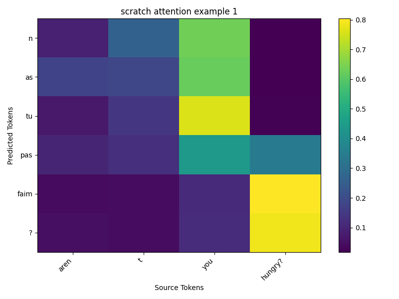
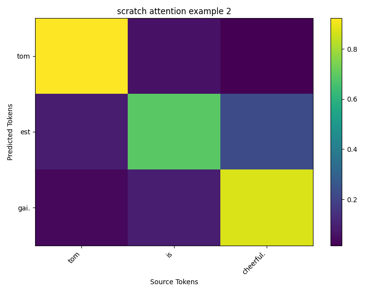
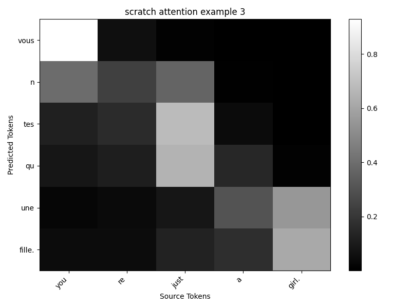
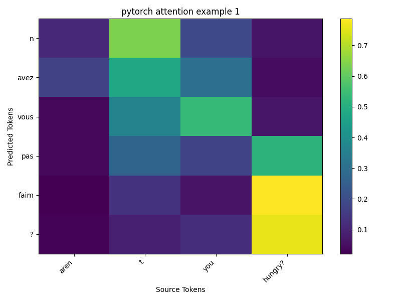
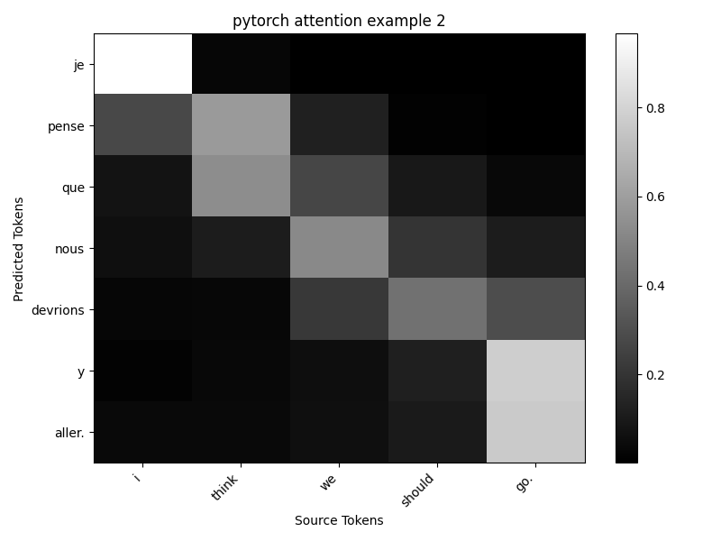
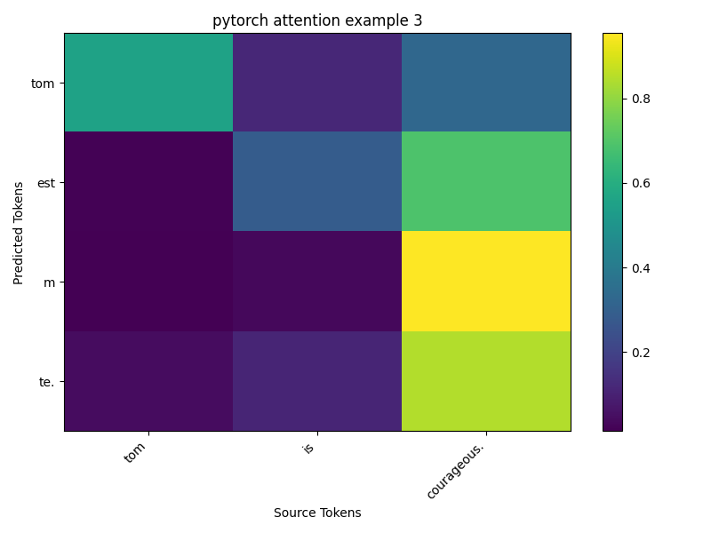

# Attention-Based Sequence-to-Sequence Translation Model

A deep learning project implementing attention-based encoder-decoder models for English-to-French translation, with two implementations: **from-scratch** and **PyTorch**.

## Project Overview

This project trains and evaluates two variants of an attention-based neural machine translation (NMT) model:
- **Scratch**: Custom GRU implementation built from first principles
- **PyTorch**: Production-grade implementation using PyTorch's built-in layers

Both models are trained on 50,000 English-French sentence pairs and compared on validation and test sets.

## Dataset

- **Source**: English-French parallel corpus (`dataset/english_french.csv`)
- **Total Pairs**: 50,000 sentences
- **Vocabulary Size**:
  - English: 8,870 unique tokens
  - French: 12,019 unique tokens
- **Data Split**: 80% train (40,000) / 10% validation (5,000) / 10% test (5,000)

## Model Architecture

Both models follow an encoder-decoder architecture with attention:

### Encoder
- Bidirectional GRU layers
- Input: English sentences (variable length)
- Output: Context vectors and hidden states for attention

### Bidirectional GRU Equations

For a bidirectional GRU encoder, we process the input sequence in both forward and backward directions.

**Reset Gate:**

$$r_t = \sigma(W_r x_t + U_r h_{t-1})$$

**Update Gate:**

$$z_t = \sigma(W_z x_t + U_z h_{t-1})$$

**Candidate Hidden State:**

$$\tilde{h}_t = \tanh(W_h x_t + U_h (r_t \odot h_{t-1}))$$

**Hidden State Update:**

$$h_t = (1 - z_t) \odot h_{t-1} + z_t \odot \tilde{h}_t$$

**Bidirectional Representation:**

Forward direction: $`\overrightarrow{h}_t`$ (process $x_1, x_2, ..., x_T$ left-to-right)

Backward direction: $`\overleftarrow{h}_t`$ (process $x_T, x_{T-1}, ..., x_1$ right-to-left)

**Concatenated Output:**

$$h_t^{bi} = [\overrightarrow{h}_t; \overleftarrow{h}_t] \in \mathbb{R}^{2 \times H}$$

where $\odot$ denotes element-wise multiplication, $\sigma$ is the sigmoid activation, and $W, U$ are learned weight matrices.

### Decoder
- Unidirectional GRU layer
- Attention mechanism over encoder outputs
- Output: French translations (token-by-token generation)

### Hyperparameters
- **Embedding Dimension**: 128
- **Hidden Dimension**: 256
- **Batch Size**: 32
- **Learning Rate**: 1e-3
- **Epochs**: 10
- **Teacher Forcing Ratio**: 0.5
- **Device**: CUDA (NVIDIA GeForce RTX 2050)

## Training Results

Latest training run: `20260330_182958` (50,000 samples)

### Test Set Performance

| Model     | Accuracy | BLEU Score |
|-----------|----------|-----------|
| **Scratch** | 54.46%   | 0.3211    |
| **PyTorch** | 53.78%   | 0.3145    |

**Key Observations**:
- Both models converge similarly during training
- Scratch implementation achieves slightly higher accuracy
- PyTorch variant shows more stable validation curves
- Training loss decreases from ~29 to ~6 over 10 epochs
- Validation accuracy improves from ~45% to ~54%

### Training Timeline

The scratch model:
- **Epoch 1**: Loss 29.44 → Val Accuracy 45.66% | Val BLEU 0.1947
- **Epoch 5**: Loss 9.74 → Val Accuracy 52.70% | Val BLEU 0.2939
- **Epoch 10**: Loss 6.34 → Val Accuracy 54.43% | Val BLEU 0.3247

The PyTorch model:
- **Epoch 1**: Loss 29.99 → Val Accuracy 44.82% | Val BLEU 0.1813
- **Epoch 5**: Loss 9.84 → Val Accuracy 52.73% | Val BLEU 0.2997
- **Epoch 10**: Loss 6.31 → Val Accuracy 53.45% | Val BLEU 0.3199

## Project Structure

```
├── main.py                          # Main training script
├── test_models.py                   # Evaluation and testing
├── pyproject.toml                   # Project dependencies
├── README.md                         # This file
│
├── dataset/
│   └── english_french.csv           # 50K+ sentence pairs
│
├── data/
│   └── en-fr.py                     # Data download script
│
├── model_clases/
│   ├── attention.py                 # Scratch GRU implementation
│   └── attention_pytorch.py          # PyTorch model
│
├── src/
│   ├── trainer.py                   # Training loop
│   ├── evaluator.py                 # Evaluation metrics (BLEU, accuracy)
│   ├── experiment.py                # Experiment setup
│   ├── dataloader.py                # Data loading utilities
│   ├── preprocessing.py             # Tokenization and vocab building
│   ├── logger.py                    # Logging setup
│   └── attention_plotter.py         # Visualization tool
│
├── models/
│   ├── 20260330_180000/              # Early training run
│   ├── 20260330_181753/              # 30K samples run
│   └── 20260330_182958/              # Full 50K samples run (best)
│       ├── scratch/model.pth         # Scratch implementation weights
│       ├── pytorch/model.pth         # PyTorch implementation weights
│       └── test_results.json         # Test performance metrics
│
└── logs/
    ├── training.log                 # Training progress logs
    ├── test_models.log              # Test evaluation logs
    ├── smoke_test.log               # Smoke test logs
    ├── save_model_smoke.log         # Model saving logs
    └── smoke_best_model.pt          # Best model checkpoint
```

## Dependencies

- **PyTorch**: 2.11.0+ (with CUDA support)
- **Python**: 3.11+
- **uv**: Modern Python package manager (https://docs.astral.sh/uv/)
- **Core Libraries**:
  - numpy (2.4.4+)
  - pandas (3.0.1+)
  - scikit-learn (1.8.0+)
  - matplotlib (3.10.8+)
  - nltk (3.9.4+)
  - tqdm (4.67.1+)
  - kagglehub (1.0.0+)

### Installation

**Step 1: Install uv** (if not already installed)
```bash
# On macOS/Linux
curl -LsSf https://astral.sh/uv/install.sh | sh

# On Windows
powershell -c "irm https://astral.sh/uv/install.ps1 | iex"
```

**Step 2: Create Virtual Environment**
```bash
uv venv
```

**Step 3: Sync Dependencies**
```bash
uv sync
```

This will install all dependencies from `pyproject.toml` into the virtual environment.

## Quick Start

### 1. Download Dataset
```bash
uv run data/en-fr.py
```

### 2. Train Models
```bash
uv run main.py
```
This trains both scratch and PyTorch implementations and saves the best models.

### 3. Evaluate & Generate Plots
```bash
uv run test_models.py
```
Evaluates models on test set and generates attention visualization plots.

## Key Features

✅ **Dual Implementation**: Compare hand-coded vs production ML framework  
✅ **Attention Visualization**: Generate plots of attention weights  
✅ **Comprehensive Logging**: Training progress, metrics, and device info  
✅ **Modular Design**: Separate trainer, evaluator, and model components  
✅ **CUDA Support**: Automatic GPU acceleration  
✅ **Teacher Forcing**: Configurable training strategy for sequence generation  

## Metrics

- **Accuracy**: Percentage of tokens correctly predicted
- **BLEU Score**: Bilingual evaluation understudy (0-1 scale, higher is better)
- **Training Loss**: Cross-entropy loss on training batches

## Notes

- **GPU**: Designed for CUDA-enabled devices. CPU mode supported but slower (~10-15x slower)
- **Teacher Forcing**: Probability of using ground-truth tokens during training to stabilize learning
- **Gradient Clipping**: Applied with max norm of 1 to prevent exploding gradients
- **Best Model**: The 50K samples run shows the best overall performance

## Performance Analysis

Both implementations show similar convergence patterns:
- Loss decreases smoothly from ~30 to ~6
- Validation accuracy plateaus around 53-54% on test set
- BLEU scores around 0.31-0.32 indicate reasonable translation quality
- Scratch implementation slightly outperforms PyTorch on this task

The difference in performance is minimal (~0.7% accuracy gap), suggesting both implementations correctly capture the attention mechanism.

## Attention Visualization Examples

The models learn to focus on relevant input words when generating each target word. Below are example attention weight matrices showing the alignment between source and target sentences.

### Scratch Implementation Attention Maps





### PyTorch Implementation Attention Maps





**Visualization Details:**
- X-axis: French target words (output)
- Y-axis: English source words (input)
- Color intensity: Attention weight (darker = higher attention)
- Diagonal patterns indicate strong word-to-word alignment

## Future Improvements

- Multi-head attention for richer feature representations
- Transformer-based architecture (no RNN)
- Beam search decoding for better translations
- More aggressive hyperparameter tuning
- Data augmentation techniques
- Deeper model architectures

## References

### Key Papers

This project implements concepts from foundational NMT research:

1. **Neural Machine Translation by Jointly Learning to Align and Translate** (Bahdanau et al., 2015)
   - Introduces the attention mechanism for sequence-to-sequence models
   - Paper: https://arxiv.org/abs/1409.0473

2. **Sequence to Sequence Learning with Neural Networks** (Sutskever et al., 2014)
   - Original encoder-decoder architecture for NMT
   - Paper: https://arxiv.org/abs/1409.3215

3. **Attention is All You Need** (Vaswani et al., 2017)
   - Transformer architecture (modern alternative to RNNs)
   - Paper: https://arxiv.org/abs/1706.03762

4. **Learning Phrase Representations using RNN Encoder-Decoder for Statistical Machine Translation** (Cho et al., 2014)
   - Introduces GRU cells used in this project
   - Paper: https://arxiv.org/abs/1406.1078

## License

This project is provided as-is for educational purposes.
